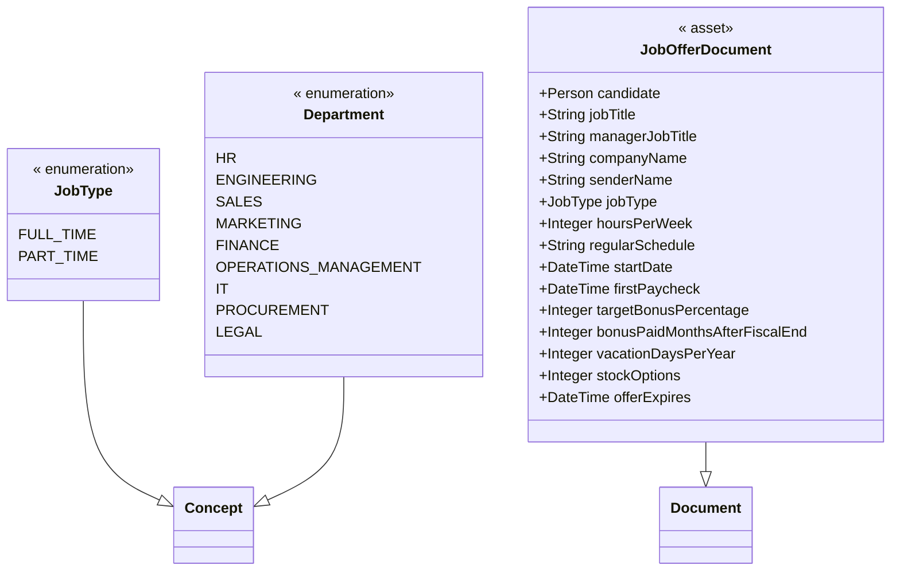

# Namespace com.docusign.agreement.hr@1.0.0

## Overview
- 0 concepts
- 2 enumerations
- 1 assets
- 0 participants
- 0 transactions
- 0 events
- 3 total declarations

## Imports
- com.docusign.personal@1.0.0.Person
- com.docusign.agreement@1.0.0.Agreement
- com.docusign.agreement@1.0.0.Document
- concerto@1.0.0.Concept
- concerto@1.0.0.Asset
- concerto@1.0.0.Transaction
- concerto@1.0.0.Participant
- concerto@1.0.0.Event

## Diagram

